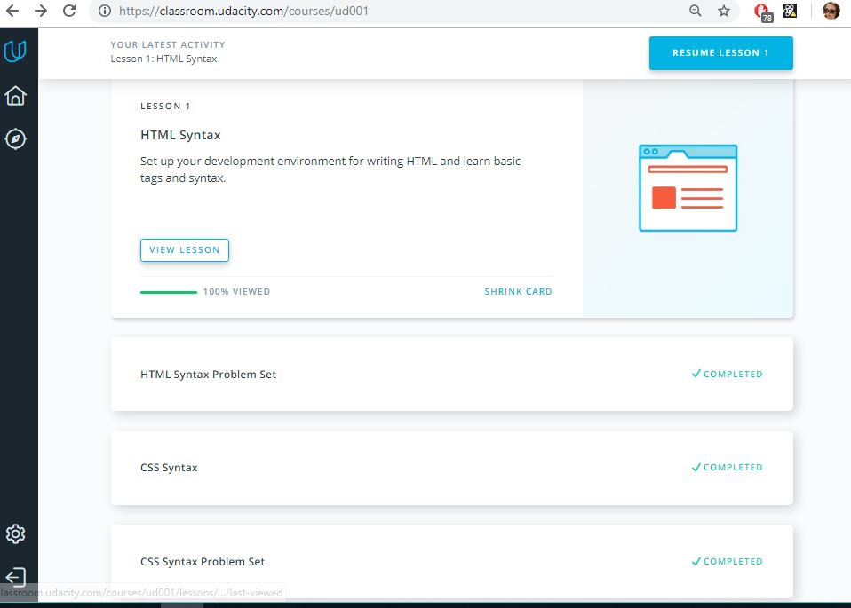
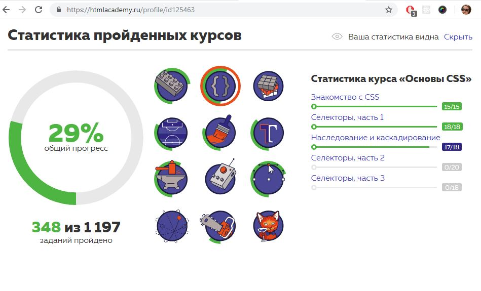
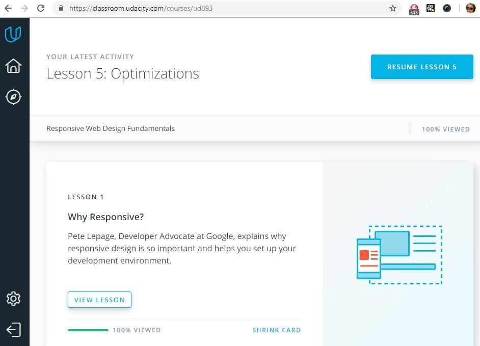
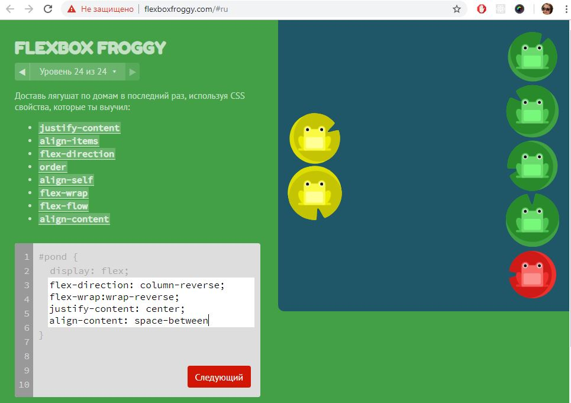
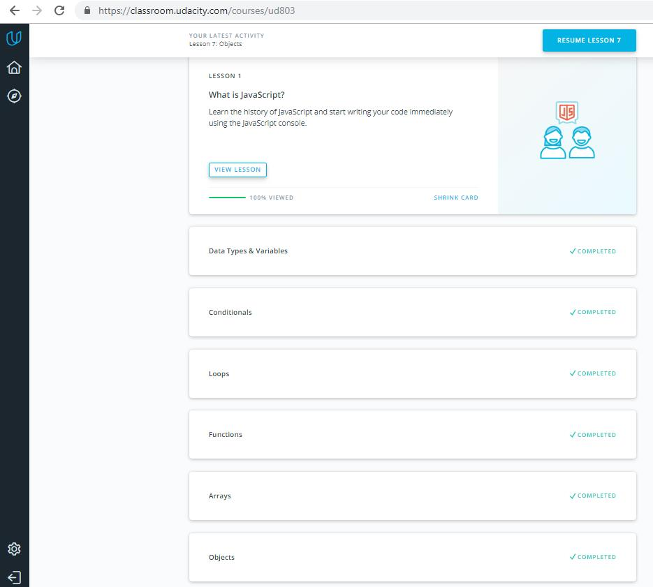
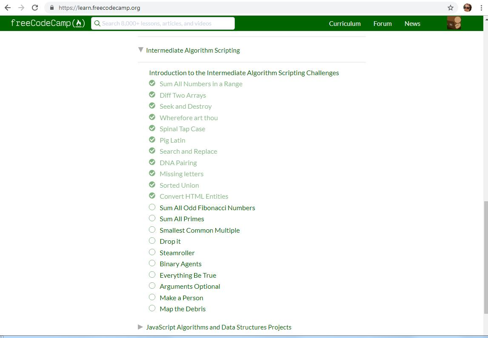

# kottans-frontend
learning with kottans community

## Git and GitHub
*The course was interesting, despite the fact that I've already had some basic skills in using Git and GitHub. It helped me to fill the existing gap in my knowledge*

## Linux CLI, and HTTP
*As a result of the finishing course **Learn the Command Line**, I learned how to use the command line correctly, how to navigate through files/folders, make changes(copy/replace/remove) on computer using main commands.
New practice for me was to work with the redirection commands and the bash profile for setting up the environment. Also I repeated HTTP's basics.*

## Git Collaboration
*It was useful to repeat the basics of Git and GitHub again, especially work with remote/forked repository.*
**Practice makes perfect**

## Intro to HTML and CSS

*The information about html and css wasn't new for me, but l really like interactive course of HTML Academy with cat Keks.*

The screenshot of completing courses see below:

## Responsive Web Design

*The theme of adaptive web design is very important, the course helped to reminder how media queries and flexbox work, about most popular layout responsive patterns. I definitely will use this all in the future.*

## JS Basics

*The course 'Intro to JS' on **udacity.com** was interesting and fast passed, opposed to course at **learn.freecodecamp.org**. The  exercises were quite difficult for me, but looking for a solution, I learned a lot of new things*

